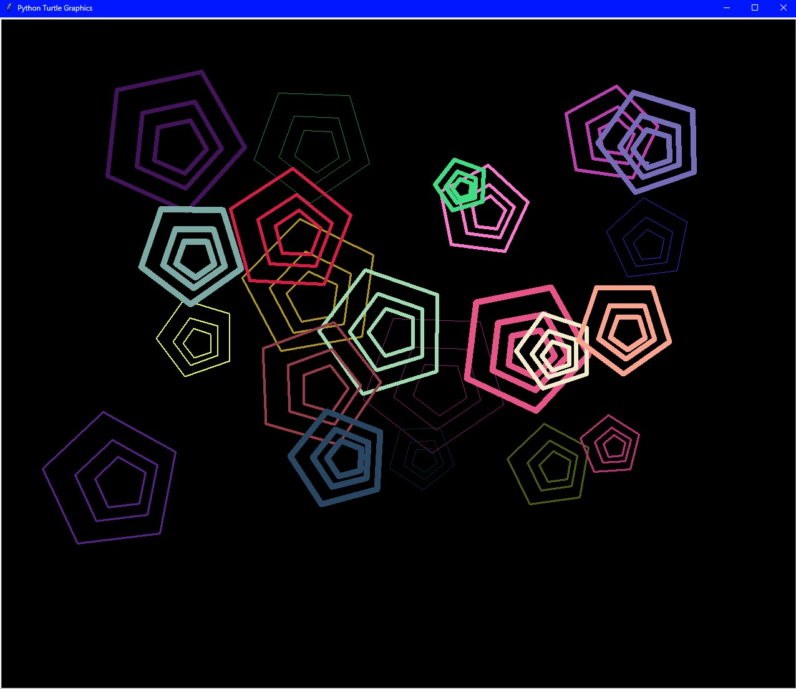

# Polygon Art (OOP)

A small Python program that generates colorful polygon-based art using the turtle module. Shapes are implemented with simple OOP classes (Triangle, Square, Pentagon, and a generic Shape) and several pattern generators.

## Requirements
- Python 3.x (turtle is part of the standard library)
- A system with a GUI (turtle opens a window)

## How to run (Windows)
1. Open a command prompt or the VS Code integrated terminal.
2. Change to your project folder
3. Run the script:
   python polygon_art_oop.py
   (If your system uses the `py` launcher, use `py polygon_art_oop.py`.)
4. When prompted, enter a number between 1 and 9 to pick a pattern.
5. A turtle graphics window will open showing the generated art. Close the window to exit.

## Notes
- Enter a valid integer (1–9) when prompted; non-integer input will raise an error.
- Patterns:
  - 1–4: single-layer shapes
  - 5–8: nested/reduced shapes
  - 9: mixed random behavior
- Colors, sizes, orientations and positions are randomized each run.
